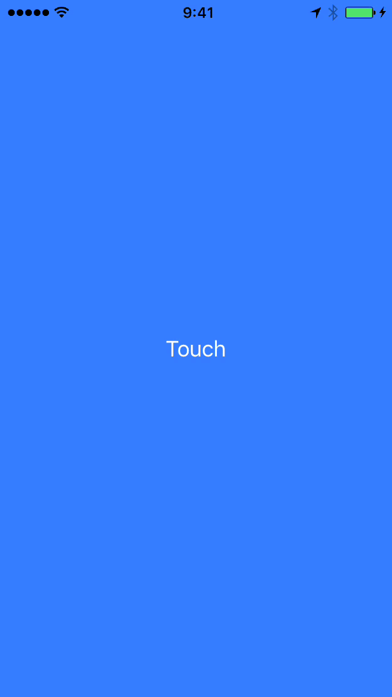

# swift-arrow
Display either right or left arrow

## ScreenShot

## Reference
[右か左かをランダムに表示するだけのiPadアプリに合計1億5000万円以上が支払われていた](http://gigazine.net/news/20160405-tsa-randomizer-cost-1-4-million/)

## License
[MIT](LICENSE)
